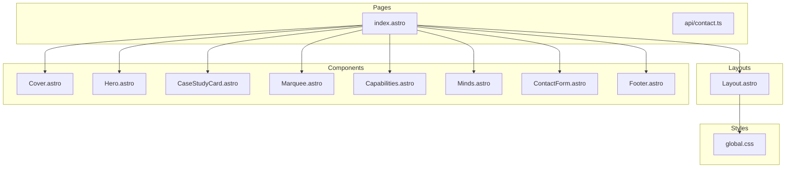
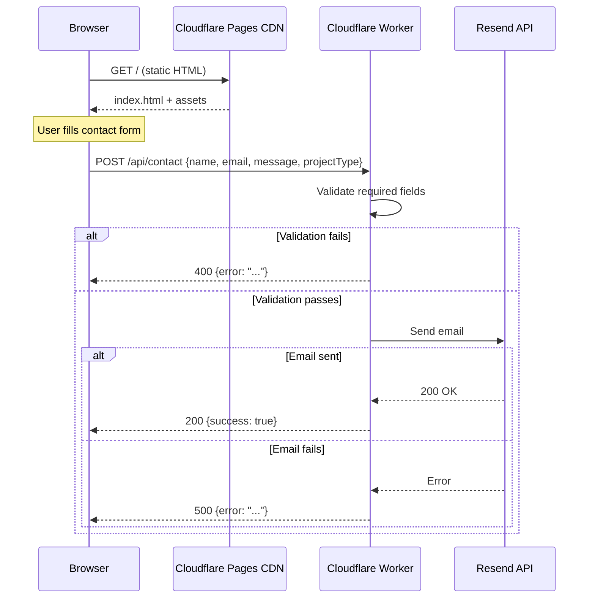
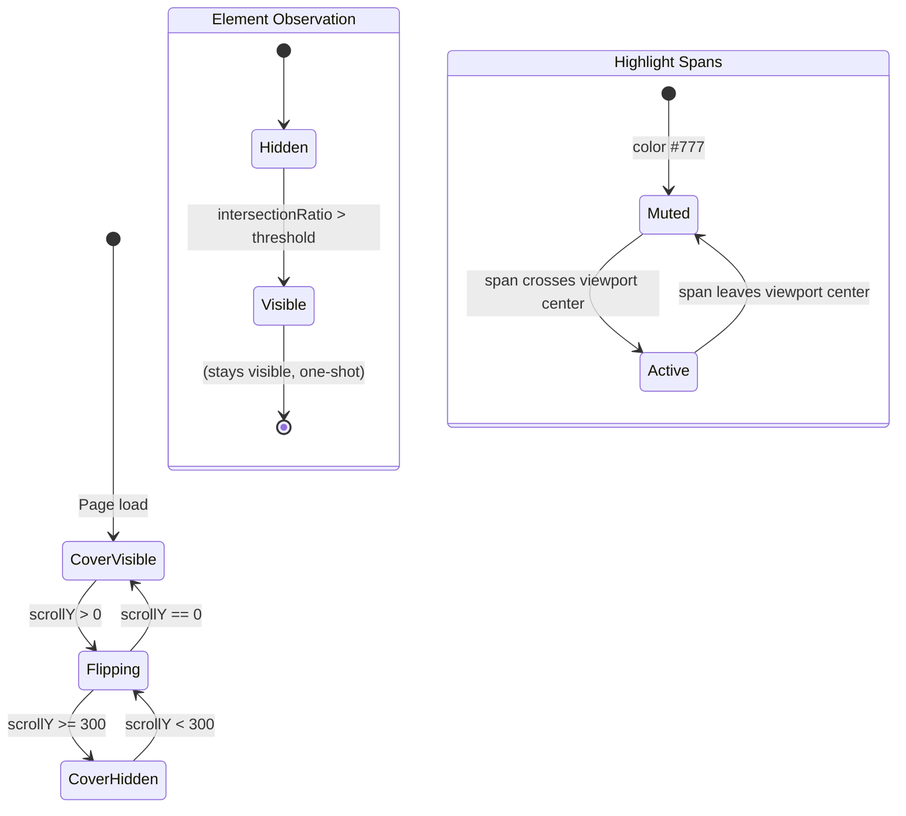

# Design Document: tszuk Landing Page

## Overview

The tszuk landing page is a single-page marketing site for a branding studio, built with Astro (static site generation), vanilla CSS, and minimal vanilla JavaScript. The architecture follows a component-per-section pattern where each visual section is an isolated `.astro` component with scoped styles. The page prioritizes performance (static HTML, optimized images, minimal JS) and accessibility (semantic markup, prefers-reduced-motion support, proper focus management).

The site is deployed on Cloudflare Pages. The only server-side logic is a single API endpoint (`/api/contact`) that validates form submissions and sends email via the Resend SDK.

---

## Architecture

### Component Architecture Diagram



### Request Flow



---

## Components and Interfaces

### Layout.astro

The base HTML shell wrapping all pages.

**Responsibilities:**
- Renders `<html>`, `<head>`, `<body>` tags
- Loads Inter font via `<link>` preconnect + stylesheet
- Imports `global.css`
- Provides a `<slot />` for page content
- Sets `<meta>` viewport, charset, description, Open Graph tags

**Props:**
```typescript
interface LayoutProps {
  title?: string;       // Page title, defaults to "tszuk — a brand that builds"
  description?: string; // Meta description
}
```

### Cover.astro

Full-viewport introductory section with 3D flip animation.

**Responsibilities:**
- Renders logotype "tszuk" and tagline "a brand that builds"
- Contains the ~20 lines of JS for scroll-mapped rotateX
- Applies `position: fixed` and `perspective` for flip effect

**Props:** None (static content)

**Internal state (JS):**
- `scrollY` mapped to rotation angle: 0px → 0deg, 300px → -180deg
- Clamps rotation between 0 and -180deg

### Hero.astro

Manifesto text block with scroll-reveal and highlight animations.

**Responsibilities:**
- Renders manifesto paragraph centered at max-width 650px
- Wraps key phrases in `<span class="highlight">` elements
- Registers Intersection Observer for scroll-reveal (`.visible` class)
- Registers Intersection Observer for highlight spans (color transition)

**Props:** None (static content)

### CaseStudyCard.astro

Reusable card component for portfolio case studies.

**Props:**
```typescript
interface CaseStudyCardProps {
  number: string;        // "01" or "02"
  clientName: string;    // e.g. "Boss Reminisce"
  descriptor: string;    // e.g. "singer/songwriter"
  scope: string[];       // e.g. ["Web presence", "Strategic partnership", "Brand management"]
  image: ImageMetadata;  // Astro image import
  imageAlt: string;      // Accessible alt text
  link: string;          // External URL
}
```

**Responsibilities:**
- Renders image with parallax container
- Renders card metadata (number, client, descriptor, scope)
- Renders "Visit" link with external arrow icon
- Intersection Observer for scroll-reveal and parallax

### Marquee.astro

Infinite horizontal scrolling logo strip.

**Responsibilities:**
- Renders duplicated set of 5 SVG placeholder icons for seamless loop
- Applies CSS `@keyframes` for horizontal translation
- Pauses on hover via `animation-play-state: paused`
- Applies gradient edge masks

**Props:** None (static placeholders)

### Capabilities.astro

Two-column services grid.

**Responsibilities:**
- Renders two columns with headings and service lists
- Column divider via CSS border
- Hover background transition
- Stacks to single column on mobile

**Props:** None (static content)

### Minds.astro

Founder portraits with blob shapes.

**Responsibilities:**
- Renders two-column grid with founder info
- Applies blob shape (`border-radius` morph animation) behind portraits
- Hover overlay with focus area tag
- Uses Astro `<Image>` for portrait optimization

**Props:** None (static content, images imported directly)

### ContactForm.astro

Contact form with client-side submission logic.

**Responsibilities:**
- Renders form fields: name, email, project type (radio), message, submit button
- Handles form submission via `fetch()` POST to `/api/contact`
- Manages UI states: idle → loading → success / error
- Focus border animation on inputs

**Props:** None (self-contained with inline `<script>`)

### Footer.astro

Studio contact information and social links.

**Responsibilities:**
- Renders email, location, and social links
- Contains the ContactForm component (or is composed alongside it in index.astro)

**Props:** None (static content)

---

## Data Models

### Contact Form Payload

```typescript
interface ContactPayload {
  name: string;
  email: string;
  projectType: "brand-identity-web" | "artist-management" | "other";
  message: string;
}
```

### API Response

```typescript
// Success
interface ContactSuccessResponse {
  success: true;
}

// Error
interface ContactErrorResponse {
  error: string;
}
```

### Contact API Validation Rules

| Field       | Required | Validation                      |
|-------------|----------|---------------------------------|
| name        | Yes      | Non-empty string, trimmed       |
| email       | Yes      | Non-empty, basic email format   |
| message     | Yes      | Non-empty string, trimmed       |
| projectType | No       | One of the defined enum values  |

---

## Scroll Interaction State Machine



**Cover Flip Logic (JS):**
```
rotation = clamp(scrollY / 300 * -180, -180, 0)
cover.style.transform = `rotateX(${rotation}deg)`
```

**Scroll Reveal (Intersection Observer):**
- Threshold: 0.15 (element 15% visible triggers)
- One-shot: `unobserve()` after adding `.visible`
- CSS handles transition: `opacity 0→1, translateY 20px→0` over 600ms

**Highlight Effect (Intersection Observer):**
- Each `<span class="highlight">` observed independently
- Threshold: 0.5 (center of viewport)
- Toggle class `.highlight--active` on intersect/unintersect
- CSS transition: `color 0.4s var(--easing)`

**Parallax (scroll listener):**
- Applied only to `.case-study-image` elements
- Offset: `scrollY * 0.05` (5% of scroll speed)
- Applied via `transform: translateY()`

---

## CSS Custom Properties Specification

```css
:root {
  /* Colors */
  --color-sage: #E6F2DD;
  --color-white: #FFFFFF;
  --color-accent: #88BDA4;
  --color-text: #181818;
  --color-dark: #1A231E;
  --color-sage-tint: #F4F9F1;
  --color-divider: #EAEAEA;
  --color-muted: #777777;

  /* Typography */
  --font-family: 'Inter', sans-serif;
  --font-weight-light: 300;
  --font-weight-regular: 400;
  --font-weight-bold: 700;
  --line-height-body: 1.6;
  --letter-spacing-subtitle: 0.15em;

  /* Spacing */
  --section-padding: 120px;
  --section-padding-mobile: 64px;
  --content-max-width: 1200px;
  --manifesto-max-width: 650px;

  /* Motion */
  --easing: cubic-bezier(0.25, 1, 0.5, 1);
  --duration-reveal: 600ms;
  --duration-highlight: 400ms;
  --duration-hover: 300ms;
  --duration-flip: 0ms; /* Scroll-driven, no fixed duration */

  /* Sizes */
  --cover-flip-threshold: 300px;
  --parallax-factor: 0.05;
  --hover-scale: 1.03;
  --blob-duration: 15s;
}

@media (prefers-reduced-motion: reduce) {
  :root {
    --duration-reveal: 0ms;
    --duration-highlight: 0ms;
    --duration-hover: 0ms;
    --blob-duration: 0ms;
  }
}
```

---

## Responsive Breakpoint Strategy

| Breakpoint       | Value   | Behavior                                              |
|------------------|---------|-------------------------------------------------------|
| Mobile           | < 768px | Single-column layouts, reduced padding, stacked cards |
| Tablet           | 768px+  | Two-column capabilities, side-by-side minds           |
| Desktop          | 1024px+ | Full spacing, all interactions enabled                |

**Implementation approach:** Mobile-first CSS with `min-width` media queries.

**Key responsive changes:**
- Capabilities grid: `grid-template-columns: 1fr` → `1fr 1fr` at 768px
- Minds grid: stacked → side-by-side at 768px
- Section padding: `var(--section-padding-mobile)` → `var(--section-padding)` at 768px
- Cover logotype: scale down font size on mobile
- Case study cards: full-bleed images on mobile, contained on desktop
- Marquee: slower speed on mobile for readability

---

## Error Handling

### Contact Form (Client-side)
- **Empty required field:** Browser native validation via `required` attribute prevents submission
- **Network failure:** Catch fetch error, display "Something went wrong. Please try again." in the form area
- **Server error (500):** Display the error message from the response body
- **Success:** Replace form with success message "Inquiry received. We will be in touch shortly."

### Contact API (Server-side)
- **Missing fields:** Return `400 { error: "Name, email, and message are required" }`
- **Invalid email format:** Return `400 { error: "Please provide a valid email address" }`
- **Resend SDK failure:** Log error server-side, return `500 { error: "Failed to send message. Please try again later." }`
- **Unexpected error:** Catch-all returns `500 { error: "An unexpected error occurred" }`

### Animation Graceful Degradation
- If JavaScript fails to load, the cover remains in its default position (no flip) and content below is accessible via scroll
- All scroll-reveal elements have a `<noscript>` fallback: elements start visible (CSS targets `.no-js` class on `<html>`)

---

## Testing Strategy

### Why Property-Based Testing Does Not Apply

This project is a static landing page with:
- UI rendering (component markup and styling) — best tested with visual regression/snapshot tests
- CSS animations — not testable via PBT
- A simple form validation endpoint with a fixed schema — too simple for meaningful universal properties (3 required fields, fixed validation rules)
- Side-effect operations (sending email via Resend) — mock-based unit tests are appropriate

There are no complex data transformations, parsers, serializers, or algorithms with large input spaces that would benefit from property-based testing.

### Testing Approach

**Unit Tests (Vitest):**
- Contact API endpoint: validate correct 400/500/200 responses for various inputs
- Form validation logic: test empty fields, invalid email, valid submissions
- Mock the Resend SDK to verify email payload construction

**Visual/Manual Testing:**
- Verify each section renders correctly across breakpoints (mobile, tablet, desktop)
- Verify prefers-reduced-motion disables all animations
- Verify scroll interactions (cover flip, scroll reveals, parallax)
- Verify keyboard navigation and focus indicators

**Lighthouse/Automated Checks:**
- Performance: target 90+ score (no CLS, fast LCP via optimized images)
- Accessibility: target 100 score (heading hierarchy, labels, focus indicators)
- Best practices: target 90+ score

**Build Verification:**
- `astro build` succeeds without errors
- All images optimized via Astro Image
- No unused CSS or JS in production bundle

---

## Performance Considerations

### Font Loading
- Preconnect to Google Fonts CDN
- Load Inter with `display=swap` to prevent FOIT (flash of invisible text)
- Subset to Latin characters only

### Image Optimization
- Use Astro `<Image>` component for automatic WebP/AVIF conversion and responsive `srcset`
- Explicit `width` and `height` attributes to prevent CLS
- Lazy-load all images below the fold (`loading="lazy"`)
- Cover section has no images — instant paint

### Animation Performance
- All animations use `transform` and `opacity` only (GPU-composited, no layout thrash)
- `will-change: transform` on the cover element and parallax images
- Intersection Observer is passive (no scroll event blocking for reveals)
- Single scroll event listener for cover flip + parallax (batched via `requestAnimationFrame`)
- Marquee uses CSS animation (off-main-thread)

### Bundle Size
- Zero JS frameworks — vanilla JS only (~20 lines for flip, ~40 lines for observers + form)
- No animation libraries (GSAP removed in favor of CSS + minimal JS)
- Total JS budget: < 3KB gzipped
- CSS: single global file + scoped component styles (tree-shaken at build)

### Deployment
- Cloudflare Pages with edge caching
- Static HTML served from CDN (no SSR for page content)
- Only `/api/contact` runs as a Cloudflare Worker (serverless function)
